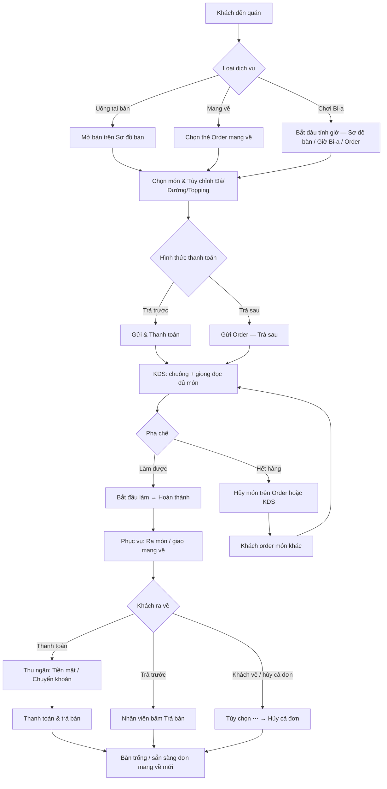

# 📖 HƯỚNG DẪN SỬ DỤNG VÀ QUY TRÌNH HỆ THỐNG BOM COFFEE & BILLIARDS

Tài liệu chi tiết quy trình vận hành và hướng dẫn thao tác từng bước cho các bộ phận (Phục vụ, Pha chế, Thu ngân, Quản lý) trên Hệ thống BOM Coffee POS.

---

## 📋 MỤC LỤC

1. [Tổng Quan Quy Trình Vận Hành Hệ Thống](#1-tổng-quan-quy-trình-vận-hành-hệ-thống)
2. [Phân Quyền Người Dùng (Role-Based Access)](#2-phân-quyền-người-dùng-role-based-access)
3. [Quy Trình 1: Phục Vụ Bàn, Mang Về & Đặt Món](#3-quy-trình-1-phục-vụ-bàn-mang-về--đặt-món)
4. [Quy Trình 2: Pha Chế KDS & Thông Báo Giọng Nói](#4-quy-trình-2-pha-chế-kds--thông-báo-giọng-nói)
5. [Quy Trình 3: Quản Lý Bàn Bi-a & Tính Tiền Giờ](#5-quy-trình-3-quản-lý-bàn-bi-a--tính-tiền-giờ)
6. [Quy Trình 4: Thanh Toán, Trả Bàn, Hủy Món & Hủy Đơn](#6-quy-trình-4-thanh-toán-trả-bàn-hủy-món--hủy-đơn)
7. [Quy Trình 5: Tra Cứu Lịch Sử Đơn Hàng](#7-quy-trình-5-tra-cứu-lịch-sử-đơn-hàng)
8. [Quy Trình 6: Báo Cáo Doanh Thu & Biểu Đồ Thống Kê](#8-quy-trình-6-báo-cáo-doanh-thu--biểu-đồ-thống-kê)
9. [Quy Trình 7: Quản Lý Menu, Giá Bi-a, Bàn & Nhân Viên](#9-quy-trình-7-quản-lý-menu-giá-bi-a-bàn--nhân-viên)
10. [Đăng Nhập & Phiên Làm Việc](#10-đăng-nhập--phiên-làm-việc)

---

## 1. TỔNG QUAN QUY TRÌNH VẬN HÀNH HỆ THỐNG

Sơ đồ tổng thể luồng hoạt động từ khi khách vào quán cho đến khi hoàn tất thanh toán / hủy đơn và trả bàn:



---

## 2. PHÂN QUYỀN NGƯỜI DÙNG (ROLE-BASED ACCESS)

Hệ thống hỗ trợ 4 vai trò chính:

| Chức năng | Quản trị (`ADMIN`) | Thu ngân (`CASHIER`) | Phục vụ (`WAITER`) | Pha chế (`BARTENDER`) |
| :--- | :---: | :---: | :---: | :---: |
| **Sơ đồ bàn, Order, Mang về** | ✅ | ✅ | ✅ | ❌ |
| **Giờ Bi-a (`/billiard`) & tính giờ** | ✅ | ✅ | ✅ | ❌ |
| **Màn hình Pha chế KDS** | ✅ | ✅ | ✅ | ✅ |
| **Hủy món / Hủy đơn** | ✅ | ✅ | ✅* | ✅** |
| **Thanh toán & Trả bàn** | ✅ | ✅ | ✅* | ❌ |
| **Lịch sử đơn hàng** | ✅ | ✅ | ❌ | ❌ |
| **Báo cáo doanh thu** | ✅ | ❌ | ❌ | ❌ |
| **Menu, Giá bi-a, Bàn, Nhân viên** | ✅ | ❌ | ❌ | ❌ |

> \* Phục vụ thao tác trên màn Order khi được phân công.  
> \*\* Pha chế chỉ **hủy món** trên KDS (hết hàng); không hủy cả đơn.

---

## 3. QUY TRÌNH 1: PHỤC VỤ BÀN, MANG VỀ & ĐẶT MÓN

### Bước 1: Mở Bàn / Order Mang Về Tại Sơ Đồ Bàn

1. Truy cập **Sơ đồ bàn** (trang chủ `/`).
2. Lọc nhanh: **Tất cả** / **Bàn nước** / **Bàn Bi-a**.
3. Quan sát trạng thái:
   - **Trống** (nền sáng): sẵn sàng đón khách.
   - **Đang phục vụ** (nền đậm): bàn đang có đơn mở.
   - **Đặt trước** (nền vàng): bàn đã được giữ chỗ.

#### Order mang về

- Thẻ **Order mang về** nằm đầu lưới (cùng nhóm bàn nước), màu xanh, biểu tượng túi.
- Chỉ hiện khi lọc **Tất cả** hoặc **Bàn nước**.
- Hệ thống dùng **một bàn nước** tên đúng `Mang về` (type `DRINK`) — không cần loại bàn riêng.
- Trạng thái thẻ:
  - **Tạo đơn mới**: chưa có đơn mở.
  - **Đang có đơn**: đang phục vụ / có order chưa đóng.
- Nhấp thẻ → vào màn Order như bàn thường.

> 💡 Nếu chưa thấy thẻ mang về: Admin tạo bàn tên **`Mang về`**, loại **Bàn nước** tại **Quản lý bàn** (`/tables`), hoặc chạy SQL:
>
> ```sql
> INSERT INTO restaurant_tables (zone_id, name, type, status, capacity, is_active)
> VALUES (1, 'Mang về', 'DRINK', 'EMPTY', 0, 1);
> ```

### Bước 2: Chọn Món & Tùy Chỉnh

1. Tìm kiếm hoặc lọc theo danh mục (Tất cả, Cà phê, Trà sữa…).
2. Nhấp món → popup **Tùy chọn món**:
   - Số lượng (`+` / `-`)
   - Mức đá / đường (`0%`, `50%`, `100%`)
   - Topping (nếu có)
   - Ghi chú thêm (ví dụ: *ít ngọt, bỏ ly mang về*)
3. Nhấn **Thêm vào giỏ hàng**.

### Bước 3: Gửi Order Xuống Pha Chế

1. Kiểm tra giỏ hàng (bên phải / drawer trên mobile).
2. (Tùy chọn) Nhập tên khách / chủ bàn.
3. Chọn hình thức:
   - **Trả sau** → **`Gửi order — trả sau`**: đơn xuống KDS, bàn giữ trạng thái đang phục vụ.
   - **Trả trước** → chọn Tiền mặt / Chuyển khoản → **`Gửi & thanh toán`**.

> 💡 Trên máy tính có thể **Ẩn giỏ hàng** để xem menu rộng hơn.  
> 💡 Món đã gửi bếp hiện ở khối **Món đã gửi bếp** — có thể **Ra món** khi bưng ra bàn, hoặc **hủy món** nếu hết hàng (xem mục 6).

---

## 4. QUY TRÌNH 2: PHA CHẾ KDS & THÔNG BÁO GIỌNG NÓI

Màn hình KDS (`/kds`) dành cho quầy pha chế (và các role được phép xem).

### 🔊 1. Thông Báo Giọng Nói & Âm Thanh

- **Chuông**: khi có đơn mới.
- **Giọng đọc tiếng Việt** (Google TTS, tốc độ ~1.5×), đọc **đủ bàn + từng món + ghi chú** (không chỉ “N món”).
  - Ví dụ đơn mới:  
    👉 *"Bàn 4 có đơn mới. 1 Trà sữa, đá 50 phần trăm, đường 100 phần trăm. 1 Sữa chua."*
  - Ví dụ hàng chờ / mang về:  
    👉 *"Có đơn chờ pha chế tại Mang về. 2 Cà phê sữa, đá 100 phần trăm."*
- **Nhắc nhở**: đơn còn ở cột *Chờ làm* quá lâu sẽ được nhắc lại.
- **Bật/Tắt âm thanh**: nút góc trên phải KDS. Lần đầu cần nhấp chuột trên trang để trình duyệt cho phép phát âm.

### 📋 2. Xử Lý Đơn

1. **Chờ làm (`PENDING`)** → **`Bắt đầu làm`** → chuyển **Đang làm**.
2. **Đang làm (`IN_PROGRESS`)** → **`Hoàn thành`** → chuyển **Đã xong**.
3. **Đã xong (`DONE`)**: lưu vết món đã pha xong; phục vụ bấm **Ra món** trên Order khi bưng ra bàn.

Có thể lọc tab theo trạng thái hoặc xem toàn bộ cột.

### ❌ 3. Hủy Món Trên KDS (Hết Hàng)

Khi hết nguyên liệu / không làm được món:

1. Ở cột **Chờ làm** hoặc **Đang làm**, mở thẻ đơn.
2. Nhấn **`Hủy món (hết hàng)`** → xác nhận.
3. Món biến mất khỏi hàng chờ KDS, trạng thái **Đã hủy**, **tiền bị trừ khỏi hóa đơn**.
4. Phục vụ / thu ngân thông báo khách và **order món khác** trên màn Order (đơn vẫn mở).

> ⚠️ Hủy món trên KDS **không** đóng bàn. Chỉ hủy cả đơn từ màn Order (mục 6.4).

---

## 5. QUY TRÌNH 3: QUẢN LÝ BÀN BI-A & TÍNH TIỀN GIỜ

Áp dụng bàn loại **Bi-a** (`BILLIARD`). Có thể thao tác từ **Sơ đồ bàn → Order**, hoặc trang **Giờ Bi-a** (`/billiard`).

### 🎱 1. Trang Giờ Bi-a (`/billiard`)

1. Xem tất cả bàn bi-a, đồng hồ realtime, tiền tạm tính.
2. **`Bắt đầu`**: mở phiên chơi.
3. **`Gọi nước`**: sang màn Order của bàn đó để order đồ uống.
4. **`Kết thúc`**: chốt giờ, xác nhận tiền phiên chơi.

### 🔗 2. Liên Kết Với Hóa Đơn

- Khi **bắt đầu** giờ bi-a, hệ thống gắn phiên chơi vào **đơn OPEN** của bàn (tự tạo đơn nếu chưa có).
- Khi **kết thúc**, tiền giờ được **cộng vào tổng đơn**.
- Khi **thanh toán & trả bàn**, phiên đang chơi (nếu còn) sẽ được xử lý / dừng theo luồng checkout.
- Khi **hủy cả đơn**, phiên bi-a đang chơi (nếu có) **kết thúc và không tính tiền**.

### ⏱️ 3. Từ Màn Order Của Bàn Bi-a

1. Mở bàn bi-a trên sơ đồ → Order.
2. Mục **Giờ chơi Bi-a** trong khu vực giỏ / hóa đơn:
   - **`Bắt đầu tính giờ`**
   - **`Kết thúc (Chốt tiền)`**
3. Nhiều lượt chơi trong ngày được lưu theo từng phiên trên đơn.

---

## 6. QUY TRÌNH 4: THANH TOÁN, TRẢ BÀN, HỦY MÓN & HỦY ĐƠN

### 💵 1. Thanh Toán Đơn Trả Sau

1. Mở bàn (hoặc **Mang về**) còn đơn chưa đóng.
2. Chọn phương thức:
   - **Tiền mặt**
   - **Chuyển khoản**: hiển thị mã VietQR / thông tin chuyển khoản theo số tiền đơn.
3. Nhấn **`Thanh toán & trả bàn`** (hoặc nút tương đương trên màn Order).
4. Đơn chuyển trạng thái hoàn thành; bàn về **Trống** (thẻ mang về về trạng thái sẵn sàng đơn mới).
5. Có thể **Xuất hóa đơn** (in) trước / sau khi chốt tùy thao tác trên màn hình.

### 🧹 2. Trả Bàn Cho Đơn Đã Thanh Toán Trước

- Khách đã trả trước, khi ra về: mở bàn → **`Trả bàn`**.
- Bàn về **Trống** trên sơ đồ.

### ✅ 3. Ra Món (Phục Vụ)

Trên màn Order, khối **Món đã gửi bếp**:

- Badge trạng thái: Chờ làm / Đang làm / Đã xong…
- **`Ra món`**: xác nhận đã bưng món đó ra bàn.
- **`Ra tất cả`**: xác nhận bưng hết các món chưa ra.

### ❌ 4. Hủy 1 Món (Hết Hàng / Khách Đổi Món)

**Khi nào dùng:** quán hết nguyên liệu món đã gửi bếp, hoặc khách muốn đổi sang món khác.

1. Mở bàn → Order → khối **Món đã gửi bếp**.
2. Nhấn icon **`✕`** cạnh món cần hủy → xác nhận **Hủy món**.
3. Kết quả:
   - Món chuyển **Đã hủy** (gạch ngang, vẫn thấy trong danh sách đã hủy).
   - Tiền món **không còn** trong tổng hóa đơn.
   - Món **biến mất** khỏi hàng chờ KDS.
   - Đơn **vẫn mở**, bàn vẫn đang phục vụ.
4. Thêm món khác vào giỏ → **Gửi order** như bình thường.

> Có thể hủy món từ **KDS** (mục 4.3) nếu pha chế phát hiện hết hàng trước.

### 🚫 5. Hủy Cả Đơn (Khách Về / Không Dùng Nữa)

**Khi nào dùng:** khách order xong rồi muốn về, không thanh toán / không dùng bàn nữa.

1. Mở bàn còn đơn OPEN → Order.
2. Trên header **Giỏ hàng**, bấm icon **`⋯` (Tùy chọn)** → **Hủy cả đơn**.
3. Đọc kỹ popup xác nhận → **Xác nhận hủy đơn**.
4. Kết quả:
   - Toàn bộ món chưa thanh toán bị hủy.
   - Phiên bi-a đang chơi (nếu có) kết thúc, **không tính tiền**.
   - Đơn lưu lịch sử với trạng thái **Đã hủy**.
   - Bàn về **Trống** trên sơ đồ.
   - Hệ thống đưa về Sơ đồ bàn.

> ⚠️ Không nhầm **Hủy món** (chỉ 1 món, bàn vẫn phục vụ) với **Hủy cả đơn** (đóng bàn).

### ✅ 6. Điều Kiện Checkout

- Các món còn hiệu lực (chưa hủy) được tính vào tổng tiền.
- Phiên bi-a đang mở sẽ được xử lý kèm khi đóng đơn thanh toán.

---

## 7. QUY TRÌNH 5: TRA CỨU LỊCH SỬ ĐƠN HÀNG

Dành cho **ADMIN** và **CASHIER** tại **Lịch sử đơn** (`/history`).

### 🔍 1. Bộ Lọc

- **Preset ngày**: Hôm nay / 7 ngày / 30 ngày / khoảng tùy chọn (Từ — Đến).
- **Bàn**, **Loại bàn** (Nước / Bi-a), **Nhân viên**.
- **Trạng thái đơn** (gồm **Đã hủy**), **Phương thức thanh toán**.
- **Đơn gọi thêm**: chỉ đơn gắn với đơn trước / không phải gọi thêm.
- **Khoảng tiền** (tối thiểu — tối đa).
- **Từ khóa**: mã đơn, tên bàn, nhân viên…
- **Sắp xếp** theo thời gian đóng / số tiền (tăng hoặc giảm).

### 📄 2. Phân Trang

- Chọn **Mỗi trang**: 10 / 20 / 50.
- Điều hướng trang bằng nút số trang / mũi tên.

### 🧾 3. Bảng Kết Quả & Chi Tiết

Trên danh sách xem nhanh:

- Mã đơn (`#…`), badge **gọi thêm** (nếu có đơn trước).
- Bàn / chủ bàn, tóm tắt món, khung giờ bi-a (nếu có).
- Thời gian đóng, nhân viên, PTTT, tổng tiền, trạng thái (Hoàn thành / Đã hủy…).

Nhấn **`Xem`** → **Chi tiết đơn** (`/history/:id`):

- Đầy đủ món (món đã hủy được đánh dấu riêng), phiên bi-a, thanh toán.
- Nếu là đơn gọi thêm: liên kết **xem đơn trước đó**.

---

## 8. QUY TRÌNH 6: BÁO CÁO DOANH THU & BIỂU ĐỒ THỐNG KÊ

Dành cho **ADMIN** tại **Báo cáo doanh thu** (`/dashboard`).

### 📅 1. Chọn Khoảng Thời Gian

- Preset: **Hôm nay** / **7 ngày qua** / **30 ngày qua** / **Tháng này**.
- Hoặc chọn ngày **Từ — Đến** tùy chỉnh.
- Nút làm mới để tải lại dữ liệu.

### 📊 2. Thẻ KPI Tóm Tắt

| Thẻ | Ý nghĩa |
| :--- | :--- |
| **Tổng doanh thu** | Doanh thu đơn đã thanh toán trong kỳ |
| **Doanh thu đồ uống** | Tiền nước / món + % tỷ trọng |
| **Doanh thu giờ bi-a** | Tiền giờ chơi + % tỷ trọng |
| **Đơn hàng & AOV** | Số đơn hoàn thành và giá trị trung bình / đơn |

### 📈 3. Các Biểu Đồ

1. **Xu hướng doanh thu theo ngày** — đường diện tích; badge đỉnh ngày / trung bình / số ngày có đơn.
2. **Cơ cấu Đồ uống vs Giờ bi-a** — thanh tỷ trọng + donut + số tiền từng phần.
3. **Phương thức thanh toán** — donut + danh sách % (Tiền mặt, QR, chuyển khoản…).
4. **Top 10 món bán chạy** — podium Top 3 + thanh xếp hạng theo số lượng.
5. **Doanh thu theo nhân viên** — thanh đóng góp từng nhân viên (tag Top 1).

> 💡 Báo cáo chỉ tính đơn **đã hoàn thành / đã thanh toán**. Đơn **đã hủy** không vào doanh thu.

---

## 9. QUY TRÌNH 7: QUẢN LÝ MENU, GIÁ BI-A, BÀN & NHÂN VIÊN

Dành cho **ADMIN**.

### 🍹 1. Món & Giá Bán (`/menu`)

- CRUD danh mục, món, topping; hình ảnh; bật/tắt tùy chọn đá–đường.
- Sắp xếp / ẩn món không bán.

### 🎱 2. Giá Bàn Bi-a (`/pricing`)

- Cấu hình đơn giá theo khung giờ / ngày / từng bàn (nếu có).

### 👥 3. Quản Lý Nhân Viên (`/staff`)

- **Thẻ thống kê**: Tổng nhân viên / Đang hoạt động / Đã khóa.
- **Tìm kiếm** (tên, tài khoản, SĐT — có debounce).
- **Lọc** theo vai trò và trạng thái (hoạt động / đã khóa).
- **Phân trang**: 10 / 20 / 50 dòng mỗi trang.
- **Thao tác**:
  - Thêm / sửa nhân viên (họ tên, SĐT, vai trò, trạng thái).
  - Đặt lại mật khẩu.
  - Khóa / mở khóa (không khóa được chính tài khoản đang đăng nhập; không khóa admin cuối cùng đang hoạt động).

### 🪑 4. Quản Lý Bàn (`/tables`)

- Thêm / sửa bàn nước hoặc bi-a (tên, loại, khu vực, sức chứa, bật/tắt hiển thị).
- **Ẩn bàn** khỏi sơ đồ (không xóa lịch sử); **không ẩn** được bàn đang phục vụ.
- Tạo bàn tên **`Mang về`** (loại bàn nước) để hiện thẻ order mang về trên sơ đồ.
- Chỉ bàn **đang hoạt động** mới hiện trên Sơ đồ bàn khi order.

---

## 10. ĐĂNG NHẬP & PHIÊN LÀM VIỆC

1. Truy cập `/login`, nhập tài khoản / mật khẩu.
2. **Token đăng nhập có hiệu lực 1 ngày** (24 giờ).
3. Khi **hết hạn**, **không có token**, hoặc token **không hợp lệ**:
   - Hệ thống xóa phiên làm việc.
   - Tự chuyển về trang **Đăng nhập**.
4. Nếu không đủ quyền vào một trang → màn **403**.
5. **Đăng xuất** bằng nút ở sidebar / menu tài khoản.

---

## 💡 LƯU Ý KHI VẬN HÀNH

1. **Trình duyệt**: ưu tiên **Chrome** hoặc **Edge** để TTS tiếng Việt ổn định.
2. **Âm thanh KDS**: lần đầu cần tương tác (click / bật âm thanh) để trình duyệt cho phép phát loa.
3. **Order mang về**: luôn dùng bàn tên `Mang về` (type `DRINK`); mỗi lúc chỉ nên có **một đơn OPEN** trên thẻ này — thanh toán / trả bàn / hủy đơn xong mới tạo đơn mang về tiếp theo cho rõ ràng.
4. **Bi-a + nước**: nên gắn cùng một bàn để tiền giờ và đồ uống gom một hóa đơn.
5. **Hủy món ≠ Hủy đơn**:
   - Icon **`✕`** = hủy **1 món** (hết hàng / đổi món) → bàn vẫn phục vụ, order món khác được.
   - Menu **`⋯` → Hủy cả đơn** = khách về / bỏ đơn → bàn trống, đơn lưu **Đã hủy**.
6. **Hard refresh (Ctrl+F5)** nếu giao diện / âm thanh không cập nhật sau khi triển khai phiên bản mới.
