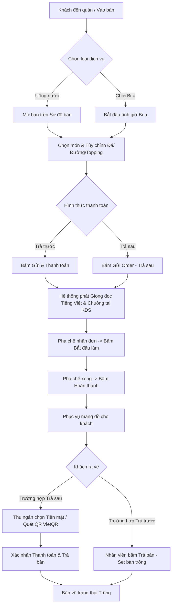

# 📖 HƯỚNG DẪN SỬ DỤNG VÀ QUY TRÌNH HỆ THỐNG BOM COFFEE & BILLIARDS

Tài liệu chi tiết quy trình vận hành và hướng dẫn thao tác từng bước cho các bộ phận (Phục vụ, Pha chế, Thu ngân, Quản lý) trên Hệ thống BOM Coffee POS.

---

## 📋 MỤC LỤC

1. [Tổng Quan Quy Trình Vận Hành Hệ Thống](#1-tổng-quan-quy-trình-vận-hành-hệ-thống)
2. [Phân Quyền Người Dùng (Role-Based Access)](#2-phân-quyền-người-dùng-role-based-access)
3. [Quy Trình 1: Phục Vụ Bàn & Đặt Món (Order Flow)](#3-quy-trình-1-phục-vụ-bàn--đặt-món-order-flow)
4. [Quy Trình 2: Pha Chế KDS & Thông Báo Giọng Nói](#4-quy-trình-2-pha-chế-kds--thông-báo-giọng-nói)
5. [Quy Trình 3: Quản Lý Bàn Bi-a & Tính Tiền Giờ](#5-quy-trình-3-quản-lý-bàn-bi-a--tính-tiền-giờ)
6. [Quy Trình 4: Thanh Toán & Trả Bàn (Checkout & Table Release)](#6-quy-trình-4-thanh-toán--trả-bàn-checkout--table-release)
7. [Quy Trình 5: Tra Cứu Lịch Sử Đơn Hàng](#7-quy-trình-5-tra-cứu-lịch-sử-đơn-hàng)
8. [Quy Trình 6: Báo Cáo Doanh Thu & Biểu Đồ Thống Kê](#8-quy-trình-6-báo-cáo-doanh-thu--biểu-đồ-thống-kê)
9. [Quy Trình 7: Quản Lý Menu, Bàn & Nhân Viên](#9-quy-trình-7-quản-lý-menu-bàn--nhân-viên)

---

## 1. TỔNG QUAN QUY TRÌNH VẬN HÀNH HỆ THỐNG

Sơ đồ tổng thể luồng hoạt động từ khi khách vào quán cho đến khi hoàn tất thanh toán và trả bàn:

---

## 2. PHÂN QUYỀN NGƯỜI DÙNG (ROLE-BASED ACCESS)

Hệ thống hỗ trợ 4 vai trò chính với các quyền tương ứng:

| Chức năng | Quản trị viên (`ADMIN`) | Thu ngân (`CASHIER`) | Phục vụ (`WAITER`) | Pha chế (`BARTENDER`) |
| :--- | :---: | :---: | :---: | :---: |
| **Sơ đồ bàn & Tạo Order** | ✅ | ✅ | ✅ | ❌ |
| **Bắt đầu / Dừng giờ Bi-a** | ✅ | ✅ | ✅ | ❌ |
| **Màn hình Pha chế KDS** | ✅ | ❌ | ❌ | ✅ |
| **Thanh toán & Trả bàn** | ✅ | ✅ | ❌ | ❌ |
| **Lịch sử đơn hàng** | ✅ | ✅ | ❌ | ❌ |
| **Báo cáo doanh thu & Biểu đồ** | ✅ | ❌ | ❌ | ❌ |
| **Quản lý Menu, Bàn, Giá, Nhân viên** | ✅ | ❌ | ❌ | ❌ |

---

## 3. QUY TRÌNH 1: PHỤC VỤ BÀN & ĐẶT MÓN (ORDER FLOW)

### Bước 1: Mở Bàn Tại Sơ Đồ Bàn
1. Truy cập trang **Sơ đồ bàn** (Trang chủ `/`).
2. Quan sát trạng thái bàn:
   - 🔘 **Bàn màu xám (Trống)**: Bàn sẵn sàng cho khách mới.
   - 🔴 **Bàn màu cam (Đang phục vụ)**: Bàn đang có khách.
3. Nhấp chọn bàn muốn order (ví dụ: `Bàn 1`).

### Bước 2: Chọn Món & Tùy Chỉnh Món Nước
1. **Tìm kiếm & Lọc**:
   - Sử dụng thanh tìm kiếm hoặc nhấp chọn các pill danh mục (Tất cả, Cà phê, Trà sữa, Sữa chua...).
2. **Tùy chỉnh món**:
   - Nhấp vào thẻ món nước để mở popup **Tùy chọn món**.
   - Chọn số lượng món (`+` / `-`).
   - Chọn mức đá (`0%`, `50%`, `100%`).
   - Chọn mức đường (`0%`, `50%`, `100%`).
   - Chọn Topping đi kèm (ví dụ: *Trân châu đen (+5.000đ)*).
   - Nhập Ghi chú thêm nếu khách yêu cầu (ví dụ: *ít ngọt, bỏ ly mang về*).
   - Nhấn **Thêm vào giỏ hàng**.

### Bước 3: Gửi Order Xuống Bếp / Pha Chế
1. Kiểm tra danh sách món trong **Giỏ hàng** bên phải.
2. (Tùy chọn) Nhập tên chủ bàn / tên khách hàng.
3. Chọn hình thức:
   - **Trả sau**: Nhấn **`Gửi order — trả sau`**. Đơn hàng chuyển xuống KDS, bàn giữ trạng thái đang phục vụ.
   - **Trả trước**: Chọn phương thức (Tiền mặt / Chuyển khoản) -> Nhấn **`Gửi & thanh toán`**.

> 💡 **Mẹo**: Trên máy tính, bạn có thể nhấn **Ẩn giỏ hàng** ở góc trên để mở rộng bảng menu món ra toàn màn hình.

---

## 4. QUY TRÌNH 2: PHA CHẾ KDS & THÔNG BÁO GIỌNG NÓI

Màn hình KDS (`/kds`) thiết kế riêng cho bộ phận bếp / quầy pha chế.

### 🔊 1. Cơ Chế Thông Báo Giọng Nói & Âm Thanh
- **Chuông Ding-Dong**: Khi có đơn mới gửi xuống, hệ thống phát tiếng chuông báo.
- **Giọng đọc Tiếng Việt**: Tự động phát âm thanh đọc rõ câu thông báo:  
  👉 *"Có đơn mới. Bàn 1. 3 món."*
- **Nhắc nhở tự động**: Nếu sau **2 phút** đơn ở cột *Chờ làm* chưa được nhận, giọng đọc sẽ tự động nhắc lại:  
  👉 *"Nhắc nhở. Còn 2 đơn đang chờ pha chế."*
- **Bật/Tắt Âm thanh**: Nhấp nút **`Âm thanh: Bật / Tắt`** góc trên bên phải màn hình KDS để chủ động quản lý.

### 📋 2. Xử Lý Đơn Tại Quầy Pha Chế
1. **Cột Chờ Làm (`PENDING`)**:
   - Nhấp nút **`Bắt đầu làm (X món)`** trên thẻ bàn. Đơn chuyển sang cột *Đang làm*.
2. **Cột Đang Làm (`IN_PROGRESS`)**:
   - Sau khi hoàn thành món, nhấp nút **`Hoàn thành (X món)`**. Đơn chuyển sang cột *Đã xong*.
3. **Cột Đã Xong (`DONE`)**:
   - Lưu vết món đã ra cho khách.

---

## 5. QUY TRÌNH 3: QUẢN LÝ BÀN BI-A & TÍNH TIỀN GIỜ

Dành cho các bàn loại Bi-a (`BILLIARD`).

### 🎱 1. Bắt Đầu Chơi Bi-a
1. Tại **Sơ đồ bàn**, nhấp chọn bàn Bi-a (có biểu tượng `MonitorPlay`).
2. Tại bảng giỏ hàng bên phải, trong mục **Giờ chơi Bi-a**, nhấp nút **`Bắt đầu tính giờ`**.
3. Đồng hồ tính giờ bắt đầu chạy theo từng giây và hiển thị số tiền tạm tính theo bảng giá cấu hình.

### ⏱️ 2. Kết Thúc Phiên Chơi Bi-a
1. Khi khách nghỉ chơi, nhấp nút **`Kết thúc (Chốt tiền)`**.
2. Hệ thống chốt tổng thời gian chơi và tính tổng tiền giờ tự động cộng vào hóa đơn thanh toán.
3. Nếu khách chơi nhiều lượt trong ngày, từng phiên chơi sẽ được lưu chi tiết bên dưới.

---

## 6. QUY TRÌNH 4: THANH TOÁN & TRẢ BÀN (CHECKOUT & TABLE RELEASE)

### 💵 1. Thanh Toán Đơn Trả Sau
1. Thu ngân mở bàn cần thanh toán tại **Sơ đồ bàn**.
2. Chọn Phương thức thanh toán:
   - **Tiền mặt**: Thu tiền trực tiếp từ khách.
   - **Chuyển khoản**: Hệ thống hiển thị **Mã VietQR động** chứa chính xác số tiền và nội dung chuyển khoản + Thông tin tài khoản ngân hàng (*MB Bank - 038 888 8888 - BOM COFFEE*).
3. Nhấp nút **`Thanh toán đơn hiện tại & trả bàn`**.
4. Đơn hàng hoàn tất và bàn tự động trở về trạng thái **Trống**.

### 🧹 2. Trả Bàn Cho Đơn Trả Trước (Set Bàn Trống)
- Đối với khách đã thanh toán trước khi nhận món, khi khách uống/chơi xong ra về:
- Nhân viên mở bàn -> Nhấp nút **`Trả bàn (Set bàn trống)`**.
- Bàn ngay lập tức trở về trạng thái **Trống** trên sơ đồ bàn sẵn sàng đón khách tiếp theo.

---

## 7. QUY TRÌNH 5: TRA CỨU LỊCH SỬ ĐƠN HÀNG

1. Truy cập mục **Lịch sử đơn** (`/history`).
2. Sử dụng bộ lọc nâng cao:
   - Chọn preset thời gian nhanh (*Hôm nay, 7 ngày, 30 ngày* hoặc chọn Từ ngày - Đến ngày).
   - Lọc theo Bàn, Loại bàn, Nhân viên lập đơn, Trạng thái đơn, Phương thức thanh toán.
3. Xem thông tin trực tiếp trên bảng dữ liệu:
   - Mã đơn hàng (`#102`).
   - Tên bàn.
   - Tóm tắt nội dung món gọi.
   - Thời gian đóng đơn.
   - Badge Phương thức thanh toán (Tiền mặt / Chuyển khoản).
   - Tổng tiền & Trạng thái.
4. Nhấp nút **`Xem`** để vào trang **Chi tiết đơn hàng** (`/history/:id`).

---

## 8. QUY TRÌNH 6: BÁO CÁO DOANH THU & BIỂU ĐỒ THỐNG KÊ

Dành cho vai trò Quản trị viên (`ADMIN`) tại mục **Báo cáo doanh thu** (`/dashboard`).

### 📊 Các Loại Biểu Đồ Thống Kê
1. **Biểu đồ Vùng Doanh Thu (Revenue Over Time)**: Phân tích biến động doanh thu theo mốc thời gian.
2. **Biểu đồ Cột Top 10 Món Bán Chạy**: Thống kê danh sách món bán ra nhiều nhất.
3. **Biểu đồ Tròn Phương Thức Thanh Toán**: Tỷ lệ doanh thu qua Tiền mặt vs Chuyển khoản.
4. **Biểu đồ Cột Doanh Thu Theo Nhân Viên**: So sánh doanh số lập đơn của các nhân viên.
5. **Biểu đồ Cột Cơ Cấu Dịch Vụ**: Phân tích doanh thu đến từ Tiền nước vs Tiền giờ bi-a.

---

## 9. QUY TRÌNH 7: QUẢN LÝ MENU, BÀN & NHÂN VIÊN

Các tính năng dành cho Quản trị viên (`ADMIN`):

### 🍹 1. Quản Lý Món & Giá Bán (`/menu`)
- Thêm mới, chỉnh sửa tên món, giá bán, danh mục, hình ảnh sản phẩm và bật/tắt tùy chọn đường đá.
- Xem trước hình ảnh đại diện kích thước lớn trực quan.

### 🎱 2. Quản Lý Giá Bàn Bi-a (`/pricing`)
- Cấu hình đơn giá giờ chơi bi-a cho các khung giờ / ngày trong tuần.

### 👥 3. Quản Lý Nhân Viên (`/staff`)
- Tạo tài khoản nhân viên mới, phân quyền truy cập (`ADMIN`, `CASHIER`, `WAITER`, `BARTENDER`).
- Đổi mật khẩu hoặc khóa/mở tài khoản nhân viên.

---

## 💡 LƯU Ý KHI VẬN HÀNH

1. **Khuyến nghị Trình duyệt**: Nên sử dụng **Google Chrome** hoặc **Microsoft Edge** trên máy tính/máy tính bảng để tính năng thông báo giọng nói đọc tiếng Việt đạt chất lượng cao nhất.
2. **Kích hoạt âm thanh lần đầu**: Trình duyệt có thể chặn tự động phát âm thanh. Nhân viên pha chế chỉ cần nhấp chuột 1 lần bất kỳ trên màn hình KDS hoặc nhấp nút **Âm thanh: Bật** để cấp quyền âm thanh cho trình duyệt.
